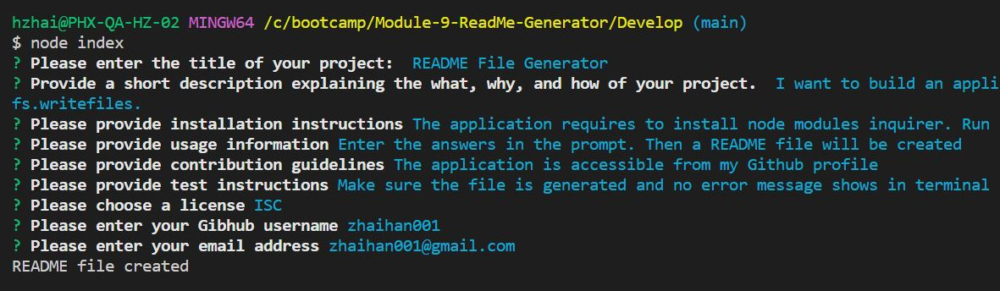

# README File Generator

## Description

I want to build an application that generates professional README file with given information. This is a good opportunity to practice how node js work. I also learned how to use npm, inquirer, template literals, and fs.writefiles.

## Table of Contents

- [Badges](#badges)
- [Installation Instruction](#installation-instruction)
- [Usage](#usage)
- [How to Contribute](#how-to-contribute)
- [License](#license)
- [Tests](#tests)
- [Questions](#questions)

## Badges

ISC License

        Copyright (c) 
        
        Permission to use, copy, modify, and/or distribute this software for any
        purpose with or without fee is hereby granted, provided that the above
        copyright notice and this permission notice appear in all copies.
        
        THE SOFTWARE IS PROVIDED "AS IS" AND THE AUTHOR DISCLAIMS ALL WARRANTIES WITH
        REGARD TO THIS SOFTWARE INCLUDING ALL IMPLIED WARRANTIES OF MERCHANTABILITY
        AND FITNESS. IN NO EVENT SHALL THE AUTHOR BE LIABLE FOR ANY SPECIAL, DIRECT,
        INDIRECT, OR CONSEQUENTIAL DAMAGES OR ANY DAMAGES WHATSOEVER RESULTING FROM
        LOSS OF USE, DATA OR PROFITS, WHETHER IN AN ACTION OF CONTRACT, NEGLIGENCE OR
        OTHER TORTIOUS ACTION, ARISING OUT OF OR IN CONNECTION WITH THE USE OR
        PERFORMANCE OF THIS SOFTWARE.

## Installation Instruction

The application requires to install node modules inquirer. Run command "npm init -y" to install npm packages. Then run "npm i inquirer@8.2.4" to install inquier module with version 8.2.4

## Usage

Enter the answers in the prompt. Then a README file will be created
md

## How to Contribute

The application is accessible from my Github profile

## License

ISC

## Tests

Make sure the file is generated and no error message shows in terminal

## Questions

My Github profile: https://github.com/zhaihan001

Please feel free reach me with additional questions.
My Email Address is: zhaihan001@gmail.com